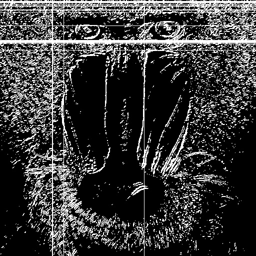

# VC_Practica_2

## Trabajo realizado.

En esta práctica se han trabajado los siguientes aspectos:
- Se han trabajado los siguientes operadores aplicados a la detección de bordes:
  -  Canny
  -  Sobel
- Comparación entre los operadores Canny y Sobel.
- Dibujar formas sobre imágenes mediante las funciones de dibujo de OpenCV.
- Abrir imagenes de disco.
- Guardar imágenes en disco.
- Aplicar umbralizados a imágenes.
- Conversión de imágenes a escala de grises.
- Desarrollar demostraciones interactivas que muestren lo aprendido en las prácticas 1 y 2.
- Uso de librerías para detectar manos.
- Identificar filas y columnas que cumplan un criterio de brillo, así como las más brillantes.

## Lista de tareas realizadas

### TAREA 1: Realiza la cuenta de píxeles blancos por filas (en lugar de por columnas). Determina el valor máximo de píxeles blancos para filas, maxfil, mostrando el número de filas y sus respectivas posiciones, con un número de píxeles blancos mayor o igual que 0.90*maxfil.

Descripción del trabajo:
1. Se leyó la imagen mandril.jpg y se convirtió a escala de grises.
2. Se aplicó el detector de bordes Canny para obtener una imagen binaria.
3. Se realizó la cuenta de píxeles blancos (valor 255) por cada fila.
4. Se determinó el valor máximo maxfil y las filas que superan el 90% de dicho máximo.

Resultados obtenidos:
Filas con más del 90% de píxeles blancos: [6, 12, 15, 20, 21, 88, 100]
Número total de filas que cumplen la condición: 7

### TAREA 2: Aplica umbralizado a la imagen resultante de Sobel (convertida a 8 bits), y posteriormente realiza el conteo por filas y columnas similar al realizado en el ejemplo con la salida de Canny de píxeles no nulos. Calcula el valor máximo de la cuenta por filas y columnas, y determina las filas y columnas por encima del 0.90*máximo. Remarca con alguna primitiva gráfica dichas filas y columnas sobre la imagen del mandril. ¿Cómo se comparan los resultados obtenidos a partir de Sobel y Canny?

Descripción del trabajo:
En esta tarea se realiza el conteo de píxeles blancos por filas y columnas al resultado de aplicar un umbralizado a la imagen resultante Sobel convertida a 8 bits. Posteriormente se obtienen el valor máximo contado tanto por filas como por columnas y las filas y columnas que tienen un valor de blanco superior a 0.9*MAXFIL y se muestran por pantalla. Después se muestra la imagen del mandril con líneas blancas en aquellas filas y columnas que cumplen el criterio mencionado. 

Resultados obtenidos:
- Las filas:  **[  2   3   4   5   8  11  12  19  20  24  51  80  81  82  83  84  85  87  100]**  y las columnas:  **[104 105 127 288]**  tiene un valor por encima de 0.9*máximo de su respectiva cuenta.
- El valor máximo encontrado por filas es:  55080.
- El valor máximo encontrado por columnas es:  55845.
- La imagen resultante es:

  </img>

Finalmente se realiza una comparación entre el uso del operador Canny y el operador Sobel.

### TAREA 3: Proponer un demostrador que capture las imágenes de la cámara, y les permita exhibir lo aprendido en estas dos prácticas ante quienes no cursen la asignatura :). Es por ello que además de poder mostrar la imagen original de la webcam, permita cambiar de modo, incluyendo al menos dos procesamientos diferentes como resultado de aplicar las funciones de OpenCV trabajadas hasta ahora.

Se utiliza la librería de Python Tkinter para crear una ventana interactiva que muestra la imagen capturada por la cámara del dispositivo y mediante una barra vertical, permite seleccionar uno de los siguientes modos:
- Normal mode
- Black and white
- Darkest and brightest pixel
- Thresholding
- Border detector
- Frame substraction

Según el modo seleccionado, la imagen que se muestra en la interfaz experimenta diferentes variaciones.
Para cerrar la ventana, ya no se debe usar la tecla "ESC" sino directamente el botón de cierre de la ventana emergente.

### TAREA 4: Tras ver los vídeos [My little piece of privacy](https://www.niklasroy.com/project/88/my-little-piece-of-privacy), [Messa di voce](https://youtu.be/GfoqiyB1ndE?feature=shared) y [Virtual air guitar](https://youtu.be/FIAmyoEpV5c?feature=shared) proponer un demostrador reinterpretando la parte de procesamiento de la imagen, tomando como punto de partida alguna de dichas instalaciones.

Se captura constantemente la imagen tomada por la cámara del equipo y, utilizando el detector de manos de la librería **mediapipe**, cuando detecta alguna mano, se modifica la imagen aplicando el efecto del final del guión de la práctica 1, en el que se convierten todos los píxeles de la imagen en círculos blancas cuyo radio es proporcional al brillo del pixel. En caso de que no se detecte ninguna mano, la imagen que muestra es la propia que se obtiene de la cámara del equipo. 

## Requisitos de ejecución

Para poder ejecutar el cuaderno de la entrega se requiere utilizar mínimo la versión de python 3.11.5, y tener instaladas las librerías: 

- opencv-python
- matplotlib
- numpy
- mediapipe
- pillow
- tkinter (Viene por defecto en la instalación de Python)

## Autoría 

- Tycho Quintana Santana. 
- Ian Samuel Trujillo Gil.

## Referencias a fuentes

- https://github.com/otsedom/otsedom.github.io/tree/main/VC/P1
- https://github.com/otsedom/otsedom.github.io/tree/main/VC/P2
- https://numpy.org/doc/2.1/reference/generated/numpy.ndarray.size.html
- https://docs.opencv.org/4.x/d2/de8/group__core__array.html#ga4b78072a303f29d9031d56e5638da78e
- https://numpy.org/doc/stable/reference/generated/numpy.where.html
- https://numpy.org/doc/stable/reference/generated/numpy.ndarray.max.html
- https://www.tutorialspoint.com/how-to-place-an-image-into-a-frame-in-tkinter
- https://www.geeksforgeeks.org/python/how-to-change-the-title-bar-in-tkinter/
- https://recursospython.com/guias-y-manuales/panel-de-pestanas-notebook-tkinter/
- https://docs.opencv.org/4.x/d2/de8/group__core__array.html#ga8873b86a29c5af51cafdcee82f8150a7
- https://www.youtube.com/watch?v=v-ebX04SNYM
- https://medium.com/@TENOCLOGY/hand-landmark-detection-and-tracking-with-mediapipe-e5268cd1c897
